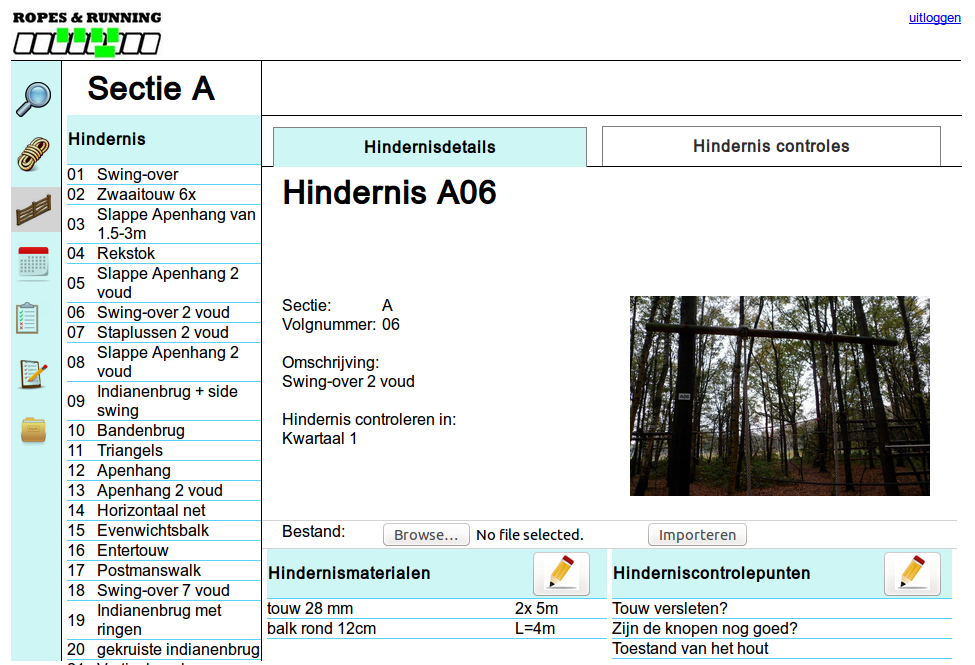

# <b>Eland</b>
Eland is een webapplicatie waarmee je een hindernislogboek kunt bijhouden. De applicatie is bedoeld voor survivalverenigingen. Zij kunnen hiermee een logboek bijhouden van de controles die ze uitvoeren op hun hindernissen.
 

Voor installatie instructie lees: <a href="docs/installatie.md">docs/installatie.md</a>.

