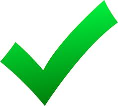
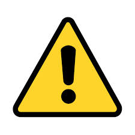
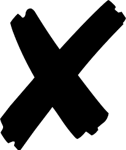

<h1>korte handleiding</h1>

<b>Inhoud</b> 
<a href="#voordatjebegint">Voordat je begint</a> 
<a href="#beginnen">Beginnen</a> 
<a href="#menu">Menu</a> 
<a href="#functieknoppen">Functieknoppen</a> 

 

<h2 id="voordatjebegint">Voordat je begint</h2>
Het programma is gemaakt voor meerdere gebruikers en het bijhouden van het logboek voor meerdere terreinen. Als eerste moet de standaard gebruiker een <a href="#terreinaanmaken">terrein aanmaken</a>, eventueel extra gebruikers en de <a href="#terreinaangebruikerkoppelen">gebruiker koppelen aan het terrein</a>.
 
Standaard is er één gebruiker aangemaakt. Deze heeft toegang tot het logboek en beheerderlogin. 
gebruikersnaam: beheerder@beheer.nl  
wachtwoord: Ik ben de beheerder!  
 
<h3 id="terreinaanmaken">Terrein aanmaken</h3>
- typ in de adresbalk van je browser: [server]/[map]/beheerderlogin.php  
  bijvoorbeeld: http://www.survivalvereniging.nl/eland/beheerderlogin.php
- log in met bovengenoemde gebruikersnaam en wachtwoord. 
  De beheerderspagina verschijnt met 3 menu items.
  - Gebruikersbeheer
  - Terreinbeheer
  - Gebruikers Terrein beheer
- Klik op het menu-item Terreinbeheer. 
  De Terreinen pagina verschijnt. 
- Geef een nieuw terreinnaam op en klik op de toevoegen knop (+). 
  Het terrein wordt toegevoegd. 
  
<h3 id="terreinaangebruikerkoppelen">Terrein aan gebruiker koppelen</h3>
(uitgangspunt: je bent ingelogd als beheerder)
- Klik op het menu-item Gebruikers Terrein beheer. 
  De Gebruikersterreinen pagina verschijnt.
- Kies een gebruiker en een terrein en klik op de toevoegen knop (+). 
  De gebruiker wordt gekoppeld aan het terrein. Je kunt beginnen!
 

<h2 id="beginnen">Beginnen</h2>
- start het programma door in de adresbalk van je browser te typen: [server]/[map] 
  bijvoorbeeld: http://www.survivalvereniging.nl/eland
- log in met de gebruikersnaam en wachtwoord van de gebruiker. 
  De hindernissecties pagina verschijnt.
 

<h2 id="menu">Menu</h2>
- controlepunten 
  Beheer een basislijst van controlepunten die je kunt toekennen aan hindernissen.
- materialen 
  Beheer een basislijst van materialen die je kunt toekennen aan hindernissen.
- hindernissen 
  Beheer je hindernissen. De hindernissen worden beheert in een of meerdere secties. Voor elke hindernis kun je een foto, materialen en controlepunten toevoegen. Verder kun je per hindernis aangeven wanneer, wie, wat gecontroleerd heeft. 
- controle agenda 
  Je kunt per hindernis aangeven hoevaak ze gecontroleerd moeten worden 1x,2x,3x of 4x per jaar.
- overzicht te controleren 
  Maak een overzicht van de te controleren hindernissen. Dit overzicht kun je afdrukken en tijdens een controle dag meegeven aan de controleurs.
- invoeren gecontroleerd 
  Na de controle kun je voor meerdere hindernissen in 1 keer de controlestatus bijwerken. Als alles goed is kun je dit in 1 keer bijwerken. Dit scheelt aanzienlijke invoertijd.
- volledig overzicht 
  Geeft een overzicht van alle hindernissen en controles. Deze functie is vooral bedoeld als papieren backup of archief.
 

<h2 id="functiekoppen">Functieknoppen</h2>
 - gegevens toevoegen 
 - geselecteerd gegeven bewerken 
 - geselecteerde gegevens verwijderen 
 - geselecteerde items verplaatsen van lijst naar detail 
 - controlepunt ok 
 - controlepunt waarschuwing 
 - controlepunt niet ok 
 - geselecteerde item verversen 
 - ingevoerde gegevens opslaan 
 - overzicht tonen 

